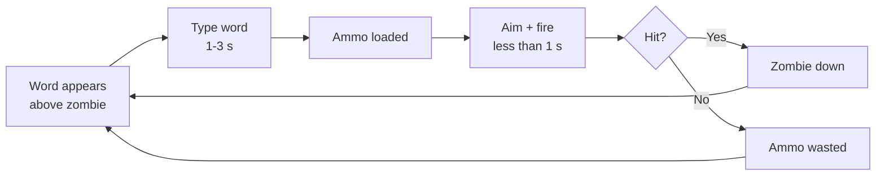
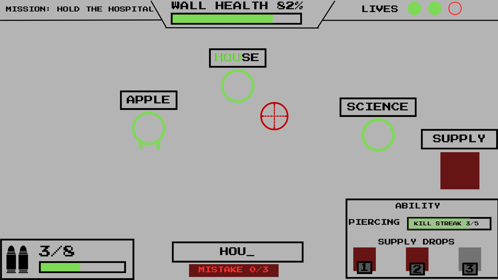
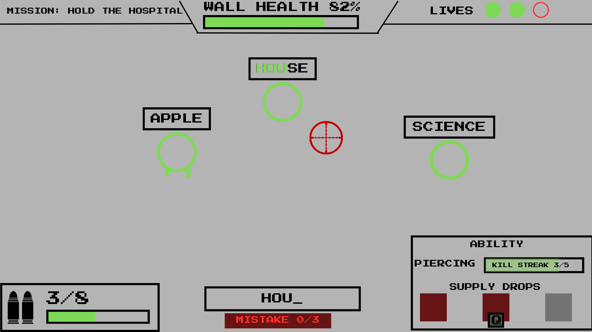

# Dead Keys — Game Design Document

| | |
|---|---|
| **Team** | Dead Keys (solo for Milestone 1; open to recruits from the design presentation) |
| **Members & roles** | @danganroma (design lead · tech lead · art lead · producer) |
| **Engine / platform** | Godot 4.7 / Windows, Linux (primary), macOS (secondary) |
| **Repo** | [add once the course namespace is created] |
| **Doc version** | v0.6 |
| **Last updated** | 2026-07-13 |

## Changelog

| Version | Date | Change | Who |
|---|---|---|---|
| v0.1 | 2026-07-12 | Initial concept and core gameplay drafted | Romart Danganan |
| v0.2 | 2026-07-12 | Expanded scope definition, priorities, and player controls | Romart Danganan |
| v0.3 | 2026-07-12 | Expanded combat, enemy types, typing and mistake systems | Romart Danganan |
| v0.4 | 2026-07-12 | Added movement rules, interactive objects, and combat balance data | Romart Danganan |
| v0.5 | 2026-07-12 | Defined economy, progression, and save model | Romart Danganan |
| v0.6 | 2026-07-12 | Added screen flow, narrative, and level content plan | Romart Danganan |
| v0.7 | 2026-07-13 | Added interface, controls, accessibility, and AI design | Romart Danganan |

---

# 1. Page One — The Core

## 1.1 Hook

For typing-game players who want a real skill ceiling, and arena-shooter players who want a hook they haven't seen, Dead Keys is a top-down zombie-defense shooter where typing loads your gun but never fires it. Every zombie carries a word above its head; typing it converts into ammunition, but the player must then manually aim and shoot, with no lock-on. Typing skill decides how much ammunition exists. Aiming skill decides whether it's spent well.

## 1.2 Design pillars

| Pillar | What it means | Consequences (what it forbids/forces) |
|---|---|---|
| 1. "Typing earns, aiming spends" | Typing and damage are never the same action. | Forbids any mechanic where a completed word directly damages an enemy. Forces every new system (abilities, supplies) to resolve through a manual aim/fire action, never an automatic one. |
| 2. "Choose your run before you start it" | Build variety lives in a pre-mission menu, not in mid-run pickups. | Forbids randomised or mid-mission power-ups. Forces the ability and Mission Supplies systems to both be locked in before the mission starts and unchangeable once it does. |
| 3. "Mistakes cost something now, not later" | Typing errors have an immediate, visible, in-combat consequence. | Forbids delayed or score-only penalties (e.g. a mistake that only affects the end-of-mission rating). Forces the mistake system to stay to one primary and one secondary punishment, so it stays legible mid-combat. |

## 1.3 Core loop



- **Moment loop (seconds):** word appears, type it (1 to 3 s depending on length), aim, fire (under 1 s). A full cycle is roughly 2 to 4 seconds, repeated continuously against multiple simultaneous zombies.
- **Session loop (minutes):** one mission, roughly 4 to 8 minutes, ending in a mission-rating screen (medal for accuracy, shots hit, wall health, time, kill streak). A meaningful session is **one full mission**.
- **Meta loop (hours):** Home Base, buy upgrades and supplies, choose one ability, select a mission, fight, earn coins, unlock gear, repeat. A full first playthrough across all 6 missions runs several hours; medal-hunting on earlier missions with better gear extends that further.


*Fig. 1 — the meta loop shown above, as it appears to the player: Home Base to Mission and back.*

## 1.4 Audience & genre

Casual-to-mid-core PC players aged roughly 12 and up: the existing typing-game audience (students, ESL learners, edutainment crossover players) plus twin-stick/arena-shooter fans wanting a lighter, session-based game. Comparisons:

- **Epistory: Typing Chronicles / ZType** — typing games where typing itself is the damage action. We take the readable floating-word convention, reject the direct-damage model, since it caps the skill ceiling at typing speed alone.
- **Plants vs. Zombies** — casual tower/base-defense structure and tone. We take the stylised, non-horror zombie aesthetic and the permanent, deterministic upgrade economy; we reject its lane-based grid, since our combat is free-aim.

## 1.5 Look, feel, and tone

Stylised, slightly cartoonish 2D top-down, closer to Plants vs. Zombies than Left 4 Dead: high-contrast silhouettes, minimal visual noise around zombie heads and the typing input area (both must be readable at a glance mid-combat), upbeat arcade-tense music rather than dread-horror scoring. Full direction in §9.

## 1.6 Scope: goals and non-goals

### Non-goals

- No open world or free player movement; the player is stationed at a fixed base position, missions are discrete hand-authored encounters.
- No randomised loot, gacha-style unlocks, or mid-mission power-up pickups; all progression is coin-purchased and deterministic.
- No online multiplayer or networking this trimester.
- No controller support at launch; keyboard and mouse only, since typing is the core mechanic.
- No procedurally generated levels or navmesh pathfinding; arenas are open lanes, zombies move straight toward the wall (see §8.1).
- No dedicated skippable tutorial level; onboarding happens inside Mission 1 (see §5.1).
- No cheats or easter eggs this trimester.

### MoSCoW scope table

| Feature | Priority | Milestone | Owner | Status |
|---|---|---|---|---|
| TypingController + AmmoSystem | Must | Prototype (wk 3-5) | Romart Danganan | not started |
| Manual aim/fire + mistake system | Must | Prototype (wk 3-5) | Romart Danganan | not started |
| Home base, shop, ProgressionManager | Should | Vertical slice (wk 6-8) | Romart Danganan | not started |
| Ability loadout system (4 abilities) | Should | Vertical slice (wk 6-8) | Romart Danganan | not started |
| Mission Supplies system | Should | Vertical slice (wk 6-8) | Romart Danganan | not started |
| Missions 1-3 + first boss | Should | Vertical slice (wk 6-8) | Romart Danganan | not started |
| Remaining 4 abilities | Could | Final (wk 9-10) | Romart Danganan | not started |
| Missions 4-6 + second boss | Could | Final (wk 9-10) | Romart Danganan | not started |
| Mission rating / medals | Could | Final (wk 9-10) | Romart Danganan | not started |
| Online multiplayer | Won't | — | — | non-goal |
| Controller support | Won't | — | — | non-goal |

---

# 2. Gameplay & Mechanics — owner: Romart Danganan

## 2.1 Player verbs & controls

| Verb | Input | Timing / numbers | Notes |
|---|---|---|---|
| Type word | Keyboard (A-Z) | 1 to 3 s per word, validated character by character | Only the currently-targeted zombie's word is checked against keystrokes |
| Aim | Mouse move | Continuous, no acceleration curve, free 360° | Independent of typing |
| Fire | Left mouse button | 0.5 s cooldown at base fire rate (2 shots/s), upgradeable to 4 shots/s | Consumes 1 ammo unit per shot |
| Call Supply | Q | 3 s helicopter flight time before crate lands | Only usable if at least 1 supply call remains this mission |
| Select ability / mission | Mouse click, UI | Pre-mission only | Locked once the mission starts |

## 2.2 Systems & rules

### 2.2.1 Ammunition System

- **Intent:** pillar 1, typing generates the resource; it never deals damage directly.
- **Rules:** word length maps to reward tier: 3-4 letters = 1 bullet, 5-7 letters = 2 bullets, 8-10 letters = 1 charged bullet, 11+ letters = 1 explosive round. Words are drawn from a per-mission, difficulty-tiered word list (data-driven, see §10). Ammo sits in inventory until manually fired; there is no auto-fire.
- **Edge cases:** if two on-screen zombies share the same word, the earliest-spawned matching zombie is targeted, ties broken by proximity to the wall. If the player finishes typing while ammo capacity is already at its cap, the reward is discarded rather than lost as an error state (capacity limit set by the weapon's magazine-size upgrade tier).

### 2.2.2 Mistake System

- **Intent:** pillar 3, immediate and legible consequences.
- **Rules:** each incorrect keystroke costs 1 bullet from current ammo. Three consecutive mistakes (no correct keystroke between them) trigger a 2 second weapon jam, during which the Fire input is ignored. The combo counter (§2.7) resets to 0 on any mistake.
- **Edge cases:** if a mistake happens while ammo is already 0, no bullet is lost, but the consecutive-mistake counter still increments toward the jam threshold. If a jam triggers while a shot is mid-cooldown, the pending shot is discarded and the jam timer starts immediately.

### 2.2.3 Ability System

- **Intent:** pillar 2, a class-like choice made before the mission, not a mid-run pickup.
- **Rules:** exactly one ability is equipped from the Ability Select screen before a mission starts; it cannot be changed or stacked once the mission begins. *Design note: the original pitch described some abilities as streak-triggered and others (Piercing, Explosive) as triggering on the very next shot with no requirement. For a consistent, programmer-testable rule, all 8 abilities now use the same trigger: a 5-kill streak charges the ability, and it fires on the player's next shot after that.* Streak resets to 0 if a zombie reaches the wall; it does **not** reset on a player mistake (mistakes are already punished by §2.2.2, double-punishing them here would blur two separate systems).
- **Edge cases:** an earned ability charge persists until the next shot is fired, even if the streak resets in the meantime, once earned, it isn't lost. If the mission ends before the charge is spent, it is discarded (abilities do not carry between missions).


*Fig. 3 — one ability equipped; no switching once the mission starts.*

### 2.2.4 Mission Supplies System

- **Intent:** pillar 2 (secondary layer) plus an ongoing coin sink (§2.6).
- **Rules:** before a mission, coins purchase Supplies (Ammo Crate, Medical Crate, Combat Crate, Emergency Crate); each purchased supply grants one supply call for that mission. *Design note: the original pitch didn't cap purchases; a cap of 3 supplies per mission is added here to keep the HUD to 3 call-icons and stop supplies from trivialising the wall-health economy.* Pressing Call Supply (Q) while at least one call remains triggers a helicopter drop; the crate lands within 4 m of the player's position after a 3 s flight. A word then appears above the crate; the player has 8 seconds to type it before the crate is removed, whichever comes first: the timer expiring, or a zombie colliding with the crate. A successful type opens it immediately and consumes one call. Only one crate can be active at a time; a new call cannot be issued while a crate is live and unclaimed.
- **Edge cases:** pressing Call Supply with 0 calls remaining does nothing (UI shows "0 remaining"). Supplies are never lost for a mission ending early, since the call is player-triggered, not scheduled (this preserves the original pitch's core insight about player agency).



*Fig. 6 — the player calls a drop, then types the crate's word before it expires or is destroyed.*


## 2.3 Movement & physics

The player character does not move; combat is entirely aim-and-fire from a fixed base position (there is no player movement verb, deliberately, see non-goals). Bullets are simple projectiles, not hitscan, so leading a moving target is part of the aim skill: base bullet speed 18 m/s, no gravity (top-down), linear travel, circle-collider hit detection. This is an explicit decision, not an engine default, chosen because projectile travel time is what makes aiming skill-expressive rather than trivial.

## 2.4 Objects & interactions

| Object | Interaction | State carried |
|---|---|---|
| Zombie | Type its word to load ammo; aim and shoot to kill | Word, health, speed, word-difficulty tier |
| Supply crate | Type its word within 8 s to claim | Word, effect type, time-to-live |
| Base wall | Takes damage from zombies that reach it | Current health, current lives |
| Ability charge | Earned via kill streak, spent on next shot | Charged / uncharged |

## 2.5 Combat / conflict

Base fire rate 2 shots/s (0.5 s cooldown), upgradeable to 4 shots/s. Bullet damage: standard bullet 10, charged bullet 30 (small splash), explosive round 50 (2 m radius AoE). Enemy health and behaviour:

| Enemy | Health | Notes |
|---|---|---|
| Walker | 30 | Baseline, no special behaviour |
| Runner | 15 | Fast approach, short words |
| Brute | 150 | Slow, long words |
| Medic | 25 | Heals nearby zombies 10 HP/s within 3 m |
| Spitter | 25 | Attacks the wall from 6 m range, 5 dmg/hit |
| Exploder | 20 | Deals 40 dmg burst to the wall on contact, then dies |
| Commander | 40 | Buffs zombies within 4 m by +20% speed |
| Armoured | 80 | Takes 50% reduced damage from non-Piercing/Explosive sources |

*Design note: "extra lives" appears as a Base upgrade in the original pitch's progression list, but no fail-state used it. Formalised here: each mission starts with 1 life (purchasable up to 3). When wall health hits 0, one life is lost and the wall resets to 50% health if a life remains; the mission fails only once the last life is lost.*


*Fig. 4 — speed, health, and word length across the enemy roster.*

## 2.6 Economy & resources

- **What resources does the player have:** a single currency, coins.
- **How do they earn them:** a base reward per completed mission (50 to 150 coins depending on mission), plus a mission-rating bonus (+25 bronze, +50 silver, +100 gold), plus a perfect-accuracy bonus from the Typing upgrade track (+10% of that mission's reward).
- **How do they spend them:** permanent one-time Weapon/Base/Typing upgrades (100 to 500 coins each), and Mission Supplies, which must be repurchased every mission (40 to 120 coins each), keeping coins useful even after most permanent gear is bought out.
- **Why do they want more:** to unlock the remaining permanent upgrades, and because Supplies are a recurring cost that never runs out of relevance.
- **Starting values:** 0 coins. Mission 1 (Defend the Suburbs) is completable with no purchased upgrades or supplies, so there is no economic gate on entry.

## 2.7 Progression & difficulty

Missions unlock linearly: complete mission N to unlock N+1, no branching. Difficulty increases via word length, enemy variety, and (from Mission 4 onward) a tighter 3-mistake jam threshold as an explicit difficulty lever. The player sees progress through rising coin totals, unlock notifications, mission medals, and a brief on-screen callout the first time a new enemy type appears. Typing itself functions as a repeated micro-puzzle: each word has exactly one correct input, and success or failure is immediate.

## 2.8 Game options, saving, replay

Save model: checkpoint-based, one checkpoint per completed mission, persisting coins, unlocked equipment, and each mission's best medal. There is no mid-mission save; abandoning a mission mid-run does not bank partial coin earnings, which stays consistent with the Mission Supplies design (progress only banks on completion, never on an interrupted attempt). Options: word-difficulty assist, typing-speed assist (extends crate expiry time and the combo window), master/music/SFX volume sliders, colourblind-safe palette toggle, screen-shake and flash toggle. No cheats or easter eggs planned this trimester (see non-goals).

---

# 3. Screen Flow & Game States — owner: Romart Danganan

````mermaid
stateDiagram-v2
    [*] --> Title
    Title --> HomeBase
    Title --> Settings
    HomeBase --> Shop
    HomeBase --> AbilitySelect
    HomeBase --> MissionSelect
    Shop --> HomeBase
    AbilitySelect --> MissionSelect
    MissionSelect --> Gameplay
    Gameplay --> Pause
    Pause --> Gameplay
    Pause --> Settings
    Pause --> HomeBase
    Gameplay --> MissionEnd
    MissionEnd --> HomeBase
````

Title: engine splash and Start/Settings/Quit. Home Base: hub for Shop, Ability Select, and Mission Select. Shop: spend coins on permanent upgrades and this mission's Supplies. Ability Select: choose the one equipped ability. Gameplay: the mission itself. Pause: resume, settings, or quit to Home Base. Mission End: rating screen (medal, stats), returns to Home Base.

---

# 4. Story, Setting & Characters — owner: Romart Danganan

## 4.1 Narrative

Narrative is intentionally minimal (see non-goals: no cutscenes). Story is told entirely through mission title cards and escalating locations, implying a worsening outbreak without dedicated scenes or dialogue.

## 4.2 World & areas

Six mission settings, each self-contained with no explicit overworld map: Suburbs → Hospital → Shopping Centre → Rescue site → Military Base → Downtown. The arc implies spreading infection through increasingly critical infrastructure. Full list in §5.2.

## 4.3 Characters

The player character is an unnamed defender with no dialogue or animation budget beyond idle/aim/fire. The zombie roster (§2.5, §8.1) functions as the game's only "cast," differentiated by type rather than individual identity, which keeps the character-animation budget to one shared rig (see §9).

---

# 5. Levels & Content Plan — owner: Romart Danganan

## 5.1 Onboarding / training

Mission 1 (Defend the Suburbs) is the tutorial: Walkers only, short common words, a forced first supply call and a forced first ability-trigger prompt, each introduced with a one-line on-screen callout the first time it's relevant. At roughly 4 minutes, it matches the session loop defined in §1.3, so onboarding doesn't run long against the game's own pacing.

## 5.2 Level list

| Level | Synopsis | Introduces | Assets implied | Milestone |
|---|---|---|---|---|
| 1. Defend the Suburbs | Tutorial mission, first wave | Walker, Runner, tutorial prompts | 1 background, 2 enemy types | Vertical slice |
| 2. Hold the Hospital | Longer, medical-themed word list | Medic | Medic enemy, medical word list | Vertical slice |
| 3. Secure the Shopping Centre | First boss fight | Tank boss | Boss model, arena | Vertical slice |
| 4. Rescue the Survivors | Objective pressure alongside waves | Spitter, Exploder | 2 enemy types, escort objective UI | Final |
| 5. Protect the Military Base | Enemy combinations | Commander, Armoured | 2 enemy types | Final |
| 6. Final Stand: Downtown | Second boss, hardest word tier | Mutant boss | Boss model, arena | Final |


*Fig. 5 — difficulty increases across the run: more enemies, longer words, harsher mistake penalties.*

---

# 6. Interface — owner: Romart Danganan

## 6.1 Visual / HUD

Fixed top-down camera, no camera movement (the player doesn't move, see §2.3). HUD elements, each justified: ammo counter, typing input box, combo counter, wall health/lives, supply-call counter with an active-crate timer when relevant. Menus: Home Base hub (Shop / Ability Select / Mission Select buttons), Pause menu (Resume / Settings / Quit to Home Base).



*Fig. 2 — words float above zombies; typing loads ammo; aim and fire are separate inputs.*

## 6.2 Audio, music, sound effects

Music direction: upbeat, arcade-tense, reinforcing the action-arcade identity rather than horror dread. SFX per verb/event: correct keystroke (soft click), mistake (short buzz), weapon fire (per weapon tier), weapon jam (mechanical stutter), zombie death (per type), crate landing (thud and beep), crate claimed (chime), mission complete (fanfare, tiered by medal). Mixing rule: SFX ducks music by roughly 3 dB on a weapon jam or boss intro, so the moment reads clearly.

## 6.3 Help system

First-time contextual tooltips when a new enemy, ability, or supply type appears; a "How to Play" page in the pause menu. No dedicated tutorial level beyond Mission 1 (see non-goals).

---

# 7. Controls & Accessibility — owner: Romart Danganan

- Full input remapping: **yes** for aim, fire, and Call Supply. **No** for the typing keys themselves, since they must match the displayed word exactly; this is flagged as a known accessibility limitation, mitigated by the word-difficulty and typing-speed assist options below rather than remapping.
- Hold-to-toggle alternative for Fire: **yes**, once the higher fire-rate weapon upgrade is unlocked.
- Colour is never the only information channel: **yes**, enemy types are differentiated by silhouette and word-label border colour together, and the palette is checked for colour-blindness.
- Subtitle size/contrast options: **yes**, for on-screen callouts. Screen-shake and flash toggles: **yes**.
- Difficulty options framed as player choice (assist modes), not shame: **yes**, word-difficulty assist and typing-speed assist are named as such.
- Text size minimum: **16 pt at 1080p** for floating word labels, larger than typical UI text since they must be read at a glance mid-combat.

---

# 8. Artificial Intelligence — owner: Romart Danganan

## 8.1 Opponent / enemy AI

All zombie types share one state machine: Spawn → Approach (straight-line toward the base wall, since arenas are open lanes with no obstacles, see non-goals) → Attack (on contact with the wall) → Dead. Medic, Spitter, Commander, and Exploder each add one extra state (Support/Ranged Attack/Buff Aura/Detonate respectively) layered on the same base machine, rather than separate logic, keeping every enemy variant a scene-level configuration change (§10) rather than new code. Readability: each type has a distinct silhouette and a distinct word-label border colour, so the player can triage the wave at a glance without reading every word first. Since zombies target the wall rather than the player, and the player doesn't move, there's no "can't reach the player" case to design for, only separation/flocking so overlapping zombies don't visually stack.

## 8.2 Friendly / non-combat characters

None (non-goal).

## 8.3 Support AI

The Drone ability hovers at a fixed offset near the player's last aim position and fires automatically at the nearest zombie within range for its duration, using a naive nearest-enemy-in-radius check each tick with no line-of-sight requirement. This is an explicit scope simplification, acceptable because arenas are unobstructed (§2.3); it would need revisiting if level design later adds cover.

---