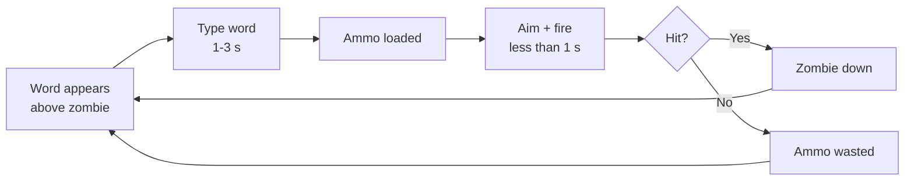

# Dead Keys — Game Design Document

| | |
|---|---|
| **Team** | Dead Keys (solo for Milestone 1; open to recruits from the design presentation) |
| **Members & roles** | @danganroma (design lead · tech lead · art lead · producer) |
| **Engine / platform** | Godot 4.7 / Windows, Linux (primary), macOS (secondary) |
| **Repo** | [add once the course namespace is created] |
| **Doc version** | v0.3 |
| **Last updated** | 2026-07-12 |

## Changelog

| Version | Date | Change | Who |
|---|---|---|---|
| v0.1 | 2026-07-12 | Initial concept and core gameplay drafted | Romart Danganan |
| v0.2 | 2026-07-12 | Expanded scope definition, priorities, and player controls | Romart Danganan |
| v0.3 | 2026-07-12 | Expanded combat, enemy types, typing and mistake systems | Romart Danganan |

---

# 1. Page One — The Core

## 1.1 Hook

For typing-game players who want a real skill ceiling, and arena-shooter players who want a hook they haven't seen, Dead Keys is a top-down zombie-defense shooter where typing loads your gun but never fires it. Every zombie carries a word above its head; typing it converts into ammunition, but the player must then manually aim and shoot, with no lock-on. Typing skill decides how much ammunition exists. Aiming skill decides whether it's spent well.

## 1.2 Design pillars

| Pillar | What it means | Consequences (what it forbids/forces) |
|---|---|---|
| 1. "Typing earns, aiming spends" | Typing and damage are never the same action. | Forbids any mechanic where a completed word directly damages an enemy. Forces every new system (abilities, supplies) to resolve through a manual aim/fire action, never an automatic one. |
| 2. "Choose your run before you start it" | Build variety lives in a pre-mission menu, not in mid-run pickups. | Forbids randomised or mid-mission power-ups. Forces the ability and Mission Supplies systems to both be locked in before the mission starts and unchangeable once it does. |
| 3. "Mistakes cost something now, not later" | Typing errors have an immediate, visible, in-combat consequence. | Forbids delayed or score-only penalties (e.g. a mistake that only affects the end-of-mission rating). Forces the mistake system to stay to one primary and one secondary punishment, so it stays legible mid-combat. |

## 1.3 Core loop



- **Moment loop (seconds):** word appears, type it (1 to 3 s depending on length), aim, fire (under 1 s). A full cycle is roughly 2 to 4 seconds, repeated continuously against multiple simultaneous zombies.
- **Session loop (minutes):** one mission, roughly 4 to 8 minutes, ending in a mission-rating screen (medal for accuracy, shots hit, wall health, time, kill streak). A meaningful session is **one full mission**.
- **Meta loop (hours):** Home Base, buy upgrades and supplies, choose one ability, select a mission, fight, earn coins, unlock gear, repeat. A full first playthrough across all 6 missions runs several hours; medal-hunting on earlier missions with better gear extends that further.


*Fig. 1 — the meta loop shown above, as it appears to the player: Home Base to Mission and back.*

## 1.4 Audience & genre

Casual-to-mid-core PC players aged roughly 12 and up: the existing typing-game audience (students, ESL learners, edutainment crossover players) plus twin-stick/arena-shooter fans wanting a lighter, session-based game. Comparisons:

- **Epistory: Typing Chronicles / ZType** — typing games where typing itself is the damage action. We take the readable floating-word convention, reject the direct-damage model, since it caps the skill ceiling at typing speed alone.
- **Plants vs. Zombies** — casual tower/base-defense structure and tone. We take the stylised, non-horror zombie aesthetic and the permanent, deterministic upgrade economy; we reject its lane-based grid, since our combat is free-aim.

## 1.5 Look, feel, and tone

Stylised, slightly cartoonish 2D top-down, closer to Plants vs. Zombies than Left 4 Dead: high-contrast silhouettes, minimal visual noise around zombie heads and the typing input area (both must be readable at a glance mid-combat), upbeat arcade-tense music rather than dread-horror scoring. Full direction in §9.

## 1.6 Scope: goals and non-goals

### Non-goals

- No open world or free player movement; the player is stationed at a fixed base position, missions are discrete hand-authored encounters.
- No randomised loot, gacha-style unlocks, or mid-mission power-up pickups; all progression is coin-purchased and deterministic.
- No online multiplayer or networking this trimester.
- No controller support at launch; keyboard and mouse only, since typing is the core mechanic.
- No procedurally generated levels or navmesh pathfinding; arenas are open lanes, zombies move straight toward the wall (see §8.1).
- No dedicated skippable tutorial level; onboarding happens inside Mission 1 (see §5.1).
- No cheats or easter eggs this trimester.

### MoSCoW scope table

| Feature | Priority | Milestone | Owner | Status |
|---|---|---|---|---|
| TypingController + AmmoSystem | Must | Prototype (wk 3-5) | Romart Danganan | not started |
| Manual aim/fire + mistake system | Must | Prototype (wk 3-5) | Romart Danganan | not started |
| Home base, shop, ProgressionManager | Should | Vertical slice (wk 6-8) | Romart Danganan | not started |
| Ability loadout system (4 abilities) | Should | Vertical slice (wk 6-8) | Romart Danganan | not started |
| Mission Supplies system | Should | Vertical slice (wk 6-8) | Romart Danganan | not started |
| Missions 1-3 + first boss | Should | Vertical slice (wk 6-8) | Romart Danganan | not started |
| Remaining 4 abilities | Could | Final (wk 9-10) | Romart Danganan | not started |
| Missions 4-6 + second boss | Could | Final (wk 9-10) | Romart Danganan | not started |
| Mission rating / medals | Could | Final (wk 9-10) | Romart Danganan | not started |
| Online multiplayer | Won't | — | — | non-goal |
| Controller support | Won't | — | — | non-goal |

---

# 2. Gameplay & Mechanics — owner: Romart Danganan

## 2.1 Player verbs & controls

| Verb | Input | Timing / numbers | Notes |
|---|---|---|---|
| Type word | Keyboard (A-Z) | 1 to 3 s per word, validated character by character | Only the currently-targeted zombie's word is checked against keystrokes |
| Aim | Mouse move | Continuous, no acceleration curve, free 360° | Independent of typing |
| Fire | Left mouse button | 0.5 s cooldown at base fire rate (2 shots/s), upgradeable to 4 shots/s | Consumes 1 ammo unit per shot |
| Call Supply | Q | 3 s helicopter flight time before crate lands | Only usable if at least 1 supply call remains this mission |
| Select ability / mission | Mouse click, UI | Pre-mission only | Locked once the mission starts |

## 2.2 Systems & rules

### 2.2.1 Ammunition System

- **Intent:** pillar 1, typing generates the resource; it never deals damage directly.
- **Rules:** word length maps to reward tier: 3-4 letters = 1 bullet, 5-7 letters = 2 bullets, 8-10 letters = 1 charged bullet, 11+ letters = 1 explosive round. Words are drawn from a per-mission, difficulty-tiered word list (data-driven, see §10). Ammo sits in inventory until manually fired; there is no auto-fire.
- **Edge cases:** if two on-screen zombies share the same word, the earliest-spawned matching zombie is targeted, ties broken by proximity to the wall. If the player finishes typing while ammo capacity is already at its cap, the reward is discarded rather than lost as an error state (capacity limit set by the weapon's magazine-size upgrade tier).

### 2.2.2 Mistake System

- **Intent:** pillar 3, immediate and legible consequences.
- **Rules:** each incorrect keystroke costs 1 bullet from current ammo. Three consecutive mistakes (no correct keystroke between them) trigger a 2 second weapon jam, during which the Fire input is ignored. The combo counter (§2.7) resets to 0 on any mistake.
- **Edge cases:** if a mistake happens while ammo is already 0, no bullet is lost, but the consecutive-mistake counter still increments toward the jam threshold. If a jam triggers while a shot is mid-cooldown, the pending shot is discarded and the jam timer starts immediately.

### 2.2.3 Ability System

- **Intent:** pillar 2, a class-like choice made before the mission, not a mid-run pickup.
- **Rules:** exactly one ability is equipped from the Ability Select screen before a mission starts; it cannot be changed or stacked once the mission begins. *Design note: the original pitch described some abilities as streak-triggered and others (Piercing, Explosive) as triggering on the very next shot with no requirement. For a consistent, programmer-testable rule, all 8 abilities now use the same trigger: a 5-kill streak charges the ability, and it fires on the player's next shot after that.* Streak resets to 0 if a zombie reaches the wall; it does **not** reset on a player mistake (mistakes are already punished by §2.2.2, double-punishing them here would blur two separate systems).
- **Edge cases:** an earned ability charge persists until the next shot is fired, even if the streak resets in the meantime, once earned, it isn't lost. If the mission ends before the charge is spent, it is discarded (abilities do not carry between missions).


*Fig. 3 — one ability equipped; no switching once the mission starts.*

### 2.2.4 Mission Supplies System

- **Intent:** pillar 2 (secondary layer) plus an ongoing coin sink (§2.6).
- **Rules:** before a mission, coins purchase Supplies (Ammo Crate, Medical Crate, Combat Crate, Emergency Crate); each purchased supply grants one supply call for that mission. *Design note: the original pitch didn't cap purchases; a cap of 3 supplies per mission is added here to keep the HUD to 3 call-icons and stop supplies from trivialising the wall-health economy.* Pressing Call Supply (Q) while at least one call remains triggers a helicopter drop; the crate lands within 4 m of the player's position after a 3 s flight. A word then appears above the crate; the player has 8 seconds to type it before the crate is removed, whichever comes first: the timer expiring, or a zombie colliding with the crate. A successful type opens it immediately and consumes one call. Only one crate can be active at a time; a new call cannot be issued while a crate is live and unclaimed.
- **Edge cases:** pressing Call Supply with 0 calls remaining does nothing (UI shows "0 remaining"). Supplies are never lost for a mission ending early, since the call is player-triggered, not scheduled (this preserves the original pitch's core insight about player agency).


*Fig. 6 — the player calls a drop, then types the crate's word before it expires or is destroyed.*
```