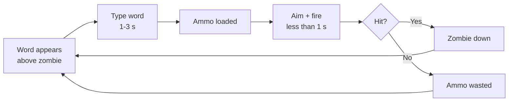

# Dead Keys — Game Design Document

| | |
|---|---|
| **Team** | Dead Keys (solo for Milestone 1; open to recruits from the design presentation) |
| **Members & roles** | @danganroma (design lead · tech lead · art lead · producer) |
| **Engine / platform** | Godot 4.7 / Windows, Linux (primary), macOS (secondary) |
| **Repo** | [add once the course namespace is created] |
| **Doc version** | v0.1 |
| **Last updated** | 2026-07-12 |

## Changelog

| Version | Date | Change | Who |
|---|---|---|---|
| v0.1 | 2026-07-12 | Initial concept and core gameplay drafted | Romart Danganan |

---

# 1. Page One — The Core

## 1.1 Hook

For typing-game players who want a real skill ceiling, and arena-shooter players who want a hook they haven't seen, Dead Keys is a top-down zombie-defense shooter where typing loads your gun but never fires it. Every zombie carries a word above its head; typing it converts into ammunition, but the player must then manually aim and shoot, with no lock-on. Typing skill decides how much ammunition exists. Aiming skill decides whether it's spent well.

## 1.2 Design pillars

| Pillar | What it means | Consequences (what it forbids/forces) |
|---|---|---|
| 1. "Typing earns, aiming spends" | Typing and damage are never the same action. | Forbids any mechanic where a completed word directly damages an enemy. Forces every new system (abilities, supplies) to resolve through a manual aim/fire action, never an automatic one. |
| 2. "Choose your run before you start it" | Build variety lives in a pre-mission menu, not in mid-run pickups. | Forbids randomised or mid-mission power-ups. Forces the ability and Mission Supplies systems to both be locked in before the mission starts and unchangeable once it does. |
| 3. "Mistakes cost something now, not later" | Typing errors have an immediate, visible, in-combat consequence. | Forbids delayed or score-only penalties (e.g. a mistake that only affects the end-of-mission rating). Forces the mistake system to stay to one primary and one secondary punishment, so it stays legible mid-combat. |

## 1.3 Core loop



- **Moment loop (seconds):** word appears, type it (1 to 3 s depending on length), aim, fire (under 1 s). A full cycle is roughly 2 to 4 seconds, repeated continuously against multiple simultaneous zombies.
- **Session loop (minutes):** one mission, roughly 4 to 8 minutes, ending in a mission-rating screen (medal for accuracy, shots hit, wall health, time, kill streak). A meaningful session is **one full mission**.
- **Meta loop (hours):** Home Base, buy upgrades and supplies, choose one ability, select a mission, fight, earn coins, unlock gear, repeat. A full first playthrough across all 6 missions runs several hours; medal-hunting on earlier missions with better gear extends that further.


*Fig. 1 — the meta loop shown above, as it appears to the player: Home Base to Mission and back.*

## 1.4 Audience & genre

Casual-to-mid-core PC players aged roughly 12 and up: the existing typing-game audience (students, ESL learners, edutainment crossover players) plus twin-stick/arena-shooter fans wanting a lighter, session-based game. Comparisons:

- **Epistory: Typing Chronicles / ZType** — typing games where typing itself is the damage action. We take the readable floating-word convention, reject the direct-damage model, since it caps the skill ceiling at typing speed alone.
- **Plants vs. Zombies** — casual tower/base-defense structure and tone. We take the stylised, non-horror zombie aesthetic and the permanent, deterministic upgrade economy; we reject its lane-based grid, since our combat is free-aim.
```