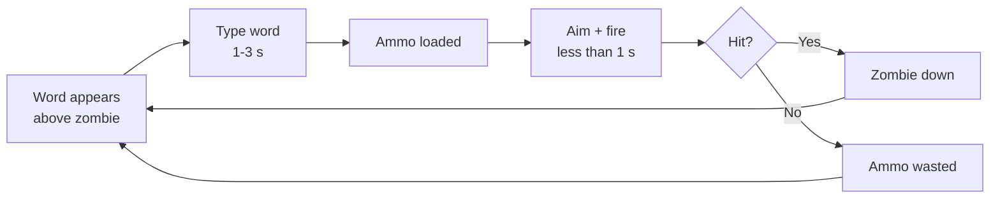

# Dead Keys - Game Design Document

| | |
|---|---|
| **Team** | Dead Keys (solo for Milestone 1; open to recruits from the design presentation) |
| **Members & roles** | @danganroma (design lead · tech lead · art lead · producer) |
| **Engine / platform** | Godot 4.7 / Windows, Linux (primary), macOS (secondary) |
| **Repo** | https://gitlab.ecs.vuw.ac.nz/course-work/cgra359/2026/assignments/danganroma/dead-keys |
| **Doc version** | v1.1 |
| **Last updated** | 39/07/2026 |

## Changelog

| Version | Date | Change | Who |
|---|---|---|---|
| v0.1–v0.6 | 2026-07-12 | Initial GDD development: drafted the core concept and gameplay loop; expanded scope, controls, combat, enemies, typing and mistake systems; added movement, interactive objects, balance data, economy, progression, saving, screen flow, narrative, and level planning. | Romart Danganan |
| v0.7 | 2026-07-13 | Added interface, controls, accessibility, and AI design | Romart Danganan |
| v0.8 | 2026-07-14 | Final Draft For Assignment 1 Submission, further tweaks needed to GDD before Final Submission. | Romart Danganan |
| v0.9 | 2026-07-15 | Large review and edits to logic and game mechanics: Call Supply moved Q→RMB, ammo tiers now scale bullet count only (not type), added mistake-system accessibility toggle, unified combo/kill-streak into one Combo counter, added Permanent Upgrade Tracks table (§2.6.1); locked scope to a single upgradeable weapon (multi-weapon flagged as deferred stretch idea); removed player-position-based supply drop and zombie-collision crate removal; removed on-screen player-character framing (no player model), simplified help-system tooltips, added word-label overlap/priority rule | Romart Danganan |
| v1.0 | 2026-07-22 | Retouched Call Supply from RMB→Nums(1 to 3) and added enemy types to scope | Romart Danganan |
| v1.1 | 2026-07-29 | Refined the Main Menu and Home Base design: added replaceable illustrated logo/background placeholders, gold display, upgrade/supply/ability panels, reusable illustrated mission cards, sequential mission locking, selected-mission details with best medal, and navigation back to the Main Menu. Removed XP from the hub design because XP is not part of the progression model. | Romart Danganan |
---

# 1. Page One - The Core

## 1.1 Hook

For typing-game players who want a real skill ceiling, and arena-shooter players who want a hook they haven't seen, Dead Keys is a top-down zombie-defense shooter where typing loads your gun but never fires it. Every zombie carries a word above its head; typing it converts into ammunition, but the player must then manually aim and shoot, with no lock-on. Typing skill decides how much ammunition exists. Aiming skill decides whether it's spent well.

## 1.2 Design pillars

| Pillar | What it means | Consequences (what it forbids/forces) |
|---|---|---|
| 1. "Typing earns, aiming spends" | Typing and damage are never the same action. | Forbids any mechanic where a completed word directly damages an enemy. Forces every new system (abilities, supplies) to resolve through a manual aim/fire action, never an automatic one. |
| 2. "Choose your run before you start it" | Build variety lives in a pre-mission menu, not in mid-run pickups. | Forbids randomised or mid-mission power-ups. Forces the ability and Mission Supplies systems to both be locked in before the mission starts and unchangeable once it does. |
| 3. "Mistakes cost something now, not later" | Typing errors have an immediate, visible, in-combat consequence. | Forbids delayed or score-only penalties (e.g. a mistake that only affects the end-of-mission rating). Forces the mistake system to stay to one primary and one secondary punishment, so it stays legible mid-combat. |

## 1.3 Core loop



- **Moment loop (seconds):** word appears, type it (1 to 3 s depending on length), aim, fire (under 1 s). A full cycle is roughly 2 to 4 seconds, repeated continuously against multiple simultaneous zombies.
- **Session loop (minutes):** one mission, roughly 4 to 8 minutes, ending in a mission-rating screen (medal for accuracy, shots hit, wall health, time, kill streak). A meaningful session is **one full mission**.
- **Meta loop (hours):** Home Base, buy upgrades and supplies, choose one ability, select a mission, fight, earn coins, unlock gear, repeat. A full first playthrough across all 6 missions runs several hours; medal-hunting on earlier missions with better gear extends that further.


*Fig. 1 - the meta loop shown above, as it appears to the player: Home Base to Mission and back.*

## 1.4 Audience & genre

Casual-to-mid-core PC players aged roughly 12 and up: the existing typing-game audience (students, ESL learners, edutainment crossover players) plus twin-stick/arena-shooter fans wanting a lighter, session-based game. Comparisons:

- **Epistory: Typing Chronicles / ZType** - typing games where typing itself is the damage action. We take the readable floating-word convention, reject the direct-damage model, since it caps the skill ceiling at typing speed alone.
- **Plants vs. Zombies** - casual tower/base-defense structure and tone. We take the stylised, non-horror zombie aesthetic and the permanent, deterministic upgrade economy; we reject its lane-based grid, since our combat is free-aim.

## 1.5 Look, feel, and tone

Stylised, slightly cartoonish 2D top-down, closer to Plants vs. Zombies than Left 4 Dead: high-contrast silhouettes, minimal visual noise around zombie heads and the typing input area (both must be readable at a glance mid-combat), upbeat arcade-tense music rather than dread-horror scoring. Full direction in §9.

## 1.6 Scope: goals and non-goals

### Non-goals

- No open world or free player movement; the player is stationed at a fixed base position, missions are discrete hand-authored encounters.
- No randomised loot, gacha-style unlocks, or mid-mission power-up pickups; all progression is coin-purchased and deterministic.
- No online multiplayer or networking this trimester.
- No controller support at launch; keyboard and mouse only, since typing is the core mechanic.
- No procedurally generated levels or navmesh pathfinding; arenas are open lanes, zombies move straight toward the wall (see §8.1).
- No dedicated skippable tutorial level; onboarding happens inside Mission 1 (see §5.1).
- No cheats or easter eggs this trimester.
- No multiple purchasable weapons at launch; a single weapon with upgradeable fire rate and damage covers the Weapon upgrade track (§2.6.1). A pistol → heavy pistol → rifle weapon-swap progression was discussed as an appealing option for immersion but is deliberately deferred as a stretch idea, not committed scope, given the one-trimester timeline.
- No rendered player character/avatar on screen; the player experiences the game from a fixed POV (aim reticle + HUD only, see §4.3).

### MoSCoW scope table

| Feature | Priority | Milestone | Owner | Status |
|---|---|---|---|---|
| TypingController + AmmoSystem | Must | Prototype (wk 3-5) | Romart Danganan | not started |
| Manual aim/fire + mistake system | Must | Prototype (wk 3-5) | Romart Danganan | not started |
| Home base, shop, ProgressionManager | Should | Vertical slice (wk 6-8) | Romart Danganan | not started |
| Ability loadout system (4 abilities) | Should | Vertical slice (wk 6-8) | Romart Danganan | not started |
| Mission Supplies system | Should | Vertical slice (wk 6-8) | Romart Danganan | not started |
| Missions 1-3 + first boss | Should | Vertical slice (wk 6-8) | Romart Danganan | not started |
| First 4 enemy types (Walker, Runner, Brute, Medic) | Should | Vertical slice (wk 6-8) | Romart Danganan | not started |
| Mistake-system accessibility toggle | Could | Vertical slice (wk 6-8) | Romart Danganan | not started |
| Remaining 4 enemy types (Spitter, Exploder, Commander, Armoured) | Could | Final (wk 9-10) | Romart Danganan | not started |
| Remaining 4 abilities | Could | Final (wk 9-10) | Romart Danganan | not started |
| Missions 4-6 + second boss | Could | Final (wk 9-10) | Romart Danganan | not started |
| Mission rating / medals | Could | Final (wk 9-10) | Romart Danganan | not started |
| Multiple purchasable weapons | Won't (this trimester) | - | - | deferred stretch idea |
| Online multiplayer | Won't | - | - | non-goal |
| Controller support | Won't | - | - | non-goal |

---

# 2. Gameplay & Mechanics - owner: Romart Danganan

## 2.1 Player verbs & controls

| Verb | Input | Timing / numbers | Notes |
|---|---|---|---|
| Type word | Keyboard (A-Z) | 1 to 3 s per word, validated character by character | Only the currently-targeted zombie's word is checked against keystrokes |
| Aim | Mouse move | Continuous, no acceleration curve, free 360° | Independent of typing |
| Fire | Left mouse button | 0.5 s cooldown at base fire rate (2 shots/s), upgradeable to 4 shots/s | Consumes 1 ammo unit per shot |
| Use Supply | Number keys 1-3 | 3 s helicopter flight time before crate lands | Each key activates the supply shown in the matching numbered HUD slot; only usable if that slot contains a supply |
| Select ability / mission | Mouse click, UI | Pre-mission only | Locked once the mission starts |

*Design note: Supplies use the number keys 1-3 rather than letter keys, because letter keys are reserved for typing zombie and crate words. Each numbered key maps directly to the supply icon carrying the same number in the HUD, allowing the player to choose a specific purchased supply without interfering with normal typing.*

## 2.2 Systems & rules

### 2.2.1 Ammunition System

- **Intent:** pillar 1, typing generates the resource; it never deals damage directly.
- **Rules:** word length maps to **bullet count only, not bullet type**: 3-4 letters = 1 bullet, 5-7 letters = 2 bullets, 8-10 letters = 3 bullets, 11+ letters = 4 bullets. All bullets are the same type and deal the same base damage (see §2.5). Words are drawn from a per-mission, difficulty-tiered word list (data-driven, see §10). Ammo sits in inventory until manually fired; there is no auto-fire.
  *Design note: earlier drafts had the 8-10 and 11+ tiers produce special "charged" and "explosive" bullet types. This is simplified to a single bullet type at increasing quantity - bullet-type variety (Piercing/Explosive-style effects) now belongs solely to the Ability system (§2.2.3) if implemented, so the Ammo System's only job stays "how much," not "what kind," consistent with pillar 1.*
- **Edge cases:** if two on-screen zombies share the same word, the earliest-spawned matching zombie is targeted, ties broken by proximity to the wall. If the player finishes typing while ammo capacity is already at its cap, the reward is discarded rather than lost as an error state (capacity limit set by the weapon's magazine-size upgrade tier). If two or more zombies are close enough that their floating word labels would visually overlap, the zombie closest to the wall (the more immediate threat) gets display priority; if several zombies are equidistant from the wall at the same time, the system staggers/offsets the labels rather than hiding them, guaranteeing at least one word remains fully readable at all times.

### 2.2.2 Mistake System

- **Intent:** pillar 3, immediate and legible consequences.
- **Rules:** each incorrect keystroke costs 1 bullet from current ammo. Three consecutive mistakes (no correct keystroke between them) trigger a 2 second weapon jam, during which the Fire input is ignored. The Combo counter (§2.7) resets to 0 on any mistake (see §2.2.3 for how this now also affects ability progress). The entire mistake system (bullet loss + jam) can be switched off as an accessibility/assist option (§2.8) - with it off, incorrect keystrokes simply aren't counted toward the word and cost nothing. This is offered as a difficulty/assist choice, not forced on.
- **Edge cases:** if a mistake happens while ammo is already 0, no bullet is lost, but the consecutive-mistake counter still increments toward the jam threshold. If a jam triggers while a shot is mid-cooldown, the pending shot is discarded and the jam timer starts immediately.

### 2.2.3 Ability System

- **Intent:** pillar 2, a class-like choice made before the mission, not a mid-run pickup.
- **Rules:** exactly one ability is equipped from the Ability Select screen before a mission starts; it cannot be changed or stacked once the mission begins. Kill streak and combo are unified into a single **Combo** counter (also shown in the HUD, §6.1): landing 5 kills in a row without a mistake charges the ability, and it fires automatically on the player's next shot after that. The Combo resets to 0 if the player makes a mistake (§2.2.2) **or** if a zombie reaches the wall, whichever happens first; either reset also cancels any in-progress (uncharged) ability build-up.
  *Design note: earlier drafts kept a separate kill-streak (for abilities) and combo (HUD/scoring) counter, with the streak deliberately surviving a mistake so the two systems wouldn't double-punish the player. On review, a single unified Combo counter that resets on both a mistake and a zombie reaching the wall was chosen instead - it reads to the player as "one number, one rule," and better matches the intended combo feel.*
- **Edge cases:** an earned ability charge persists until the next shot is fired, even if the Combo resets in the meantime - once earned, it isn't lost. If the mission ends before the charge is spent, it is discarded (abilities do not carry between missions).


*Fig. 3 - one ability equipped; no switching once the mission starts.*

### 2.2.4 Mission Supplies System

- **Intent:** pillar 2 (secondary layer) plus an ongoing coin sink (§2.6).
- **Rules:** before a mission, coins purchase Supplies (Ammo Crate, Medical Crate, Combat Crate, Emergency Crate); up to 3 purchased supplies are placed into numbered HUD slots 1-3 for that mission, with one supply in each occupied slot. Pressing the number key that matches a supply's HUD icon triggers that specific helicopter drop; the crate lands at a designated supply-drop landing spot (a fixed point per arena) after a 3 s flight. A word then appears above the crate; the player has 8 seconds to type it before the crate expires and is removed. A successful type opens it immediately and consumes the selected supply, leaving that numbered slot empty. Only one crate can be active at a time; another supply cannot be activated while a crate is live and unclaimed.
  *Design note: the crate's landing point was originally described as "within 4 m of the player's position" - but there is no on-screen player character to anchor that to (§4.3), so it's now a fixed designated drop spot per arena instead. The earlier rule where a zombie colliding with the crate also removed it has been cut; the 8 s timer alone is enough pressure without adding a second failure state.*
- **Edge cases:** pressing a number whose supply slot is empty does nothing, and its HUD icon remains visibly empty. Pressing another occupied supply slot while a crate is already active also does nothing. Supplies are never lost for a mission ending early, since activation is player-triggered rather than scheduled (this preserves the original pitch's core insight about player agency).


*Fig. 6 - the player calls a drop, then types the crate's word before it expires.*

## 2.3 Movement & physics

There is no player character to move; combat is entirely aim-and-fire from a fixed POV (there is no player movement verb, deliberately, see non-goals). Bullets are simple projectiles, not hitscan, so leading a moving target is part of the aim skill: base bullet speed 18 m/s, no gravity (top-down), linear travel, circle-collider hit detection. This is an explicit decision, not an engine default, chosen because projectile travel time is what makes aiming skill-expressive rather than trivial.

## 2.4 Objects & interactions

| Object | Interaction | State carried |
|---|---|---|
| Zombie | Type its word to load ammo; aim and shoot to kill | Word, health, speed, word-difficulty tier |
| Supply crate | Type its word within 8 s to claim | Word, effect type, time-to-live |
| Base wall | Takes damage from zombies that reach it | Current health, current lives |
| Ability charge | Earned via Combo, spent on next shot | Charged / uncharged |

## 2.5 Combat / conflict

Base fire rate 2 shots/s (0.5 s cooldown), upgradeable to 4 shots/s. Bullet damage: all bullets deal 10 base damage per hit (bullet **count** scales with word length per §2.2.1, not bullet type). Piercing/Explosive-style damage modifiers, if implemented, come from the Ability system (§2.2.3) rather than from the ammo tier. Enemy health and behaviour:

| Enemy | Health | Notes |
|---|---|---|
| Walker | 30 | Baseline, no special behaviour |
| Runner | 15 | Fast approach, short words |
| Brute | 150 | Slow, long words |
| Medic | 25 | Heals nearby zombies 10 HP/s within 3 m |
| Spitter | 25 | Attacks the wall from 6 m range, 5 dmg/hit |
| Exploder | 20 | Deals 40 dmg burst to the wall on contact, then dies |
| Commander | 40 | Buffs zombies within 4 m by +20% speed |
| Armoured | 80 | Takes 50% reduced damage from non-Piercing/Explosive ability sources |

*Design note: "extra lives" appears as a Base upgrade in the original pitch's progression list, but no fail-state used it. Formalised here: each mission starts with 1 life (purchasable up to 3, see §2.6.1). When wall health hits 0, one life is lost and the wall resets to 50% health if a life remains; the mission fails only once the last life is lost.*


*Fig. 4 - speed, health, and word length across the enemy roster.*

## 2.6 Economy & resources

- **What resources does the player have:** a single currency, coins.
- **How do they earn them:** a base reward per completed mission (50 to 150 coins depending on mission), plus a mission-rating bonus (+25 bronze, +50 silver, +100 gold), plus a perfect-accuracy bonus from the Typing upgrade track (+10% of that mission's reward).
- **How do they spend them:** permanent one-time Weapon/Base/Typing upgrades (100 to 500 coins each, see §2.6.1), and Mission Supplies, which must be repurchased every mission (40 to 120 coins each), keeping coins useful even after most permanent gear is bought out.
- **Why do they want more:** to unlock the remaining permanent upgrades, and because Supplies are a recurring cost that never runs out of relevance.
- **Starting values:** 0 coins. Mission 1 (Defend the Suburbs) is completable with no purchased upgrades or supplies, so there is no economic gate on entry.

### 2.6.1 Permanent Upgrade Tracks

The game ships with **one weapon** (see §1.6 non-goals), so weapon progression is entirely upgrade-driven rather than gear-swap-driven. Costs below are a rough first pass, scaled against the 50-150 coins/mission earn rate in §2.6 - early levels should be affordable off 1-2 missions, later levels are a multi-mission save.

| Upgrade | Track | Effect per level | Levels | Rough cost (coins, per level) |
|---|---|---|---|---|
| Fire Rate | Weapon | 2.0 → 2.5 → 3.0 → 4.0 shots/s | 3 | 150 / 250 / 400 |
| Bullet Damage | Weapon | +2 dmg/hit per level (10 base) | 3 | 150 / 300 / 500 |
| Magazine Capacity | Weapon | Raises max stored ammo | 3 | 100 / 200 / 350 |
| Fortified Wall | Base | +25 max wall health per level | 3 | 100 / 200 / 350 |
| Extra Life | Base | +1 life (starts at 1, caps at 3) | 2 | 300 / 500 |
| Jam Duration | Base | Jam length 2.0s → 1.5s → 1.0s | 2 | 150 / 250 |
| Mistake Leniency | Base | Mistakes-before-bullet-loss: 1 → 2 → 3 | 2 | 200 / 350 |
| Typing Accuracy Bonus | Typing | Existing +10% mission-coin bonus (already in §2.6) | 1 | - |

*Design note: Extra Life and the highest Fire Rate/Bullet Damage tiers are priced deliberately steep since they're the most build-defining purchases - this keeps a meaningful late-game coin sink alongside Supplies (§2.6, §2.6.1 above). Mistake Leniency and Jam Duration are cheaper and earlier, since they're accessibility-adjacent quality-of-life picks rather than power spikes. These are a first-pass proposal, not final balance - happy to revisit priority/ordering once playtesting (§11) gives real data.*

## 2.7 Progression & difficulty

Missions unlock linearly: complete mission N to unlock N+1, no branching. Difficulty increases via word length, enemy variety, and (from Mission 4 onward) a tighter 3-mistake jam threshold as an explicit difficulty lever. The player sees progress through rising coin totals, unlock notifications, mission medals, and a brief on-screen callout the first time a new enemy type appears. Typing itself functions as a repeated micro-puzzle: each word has exactly one correct input, and success or failure is immediate.

## 2.8 Game options, saving, replay

Save model: checkpoint-based, one checkpoint per completed mission, persisting coins, unlocked equipment, and each mission's best medal. There is no mid-mission save; abandoning a mission mid-run does not bank partial coin earnings, which stays consistent with the Mission Supplies design (progress only banks on completion, never on an interrupted attempt). Options: word-difficulty assist, typing-speed assist (extends crate expiry time and the combo window), mistake-system toggle (disables bullet loss and jam on incorrect keystrokes, see §2.2.2), master/music/SFX volume sliders, colourblind-safe palette toggle, screen-shake and flash toggle. No cheats or easter eggs planned this trimester (see non-goals).

---

# 3. Screen Flow & Game States - owner: Romart Danganan

````mermaid
stateDiagram-v2
    [*] --> MainMenu
    MainMenu --> HomeBase: Start
    MainMenu --> Settings
    HomeBase --> MainMenu
    HomeBase --> Settings
    HomeBase --> Upgrades
    HomeBase --> MissionSupplies
    HomeBase --> AbilityLoadout
    HomeBase --> Gameplay: Launch unlocked mission
    Upgrades --> HomeBase
    MissionSupplies --> HomeBase
    AbilityLoadout --> HomeBase
    Gameplay --> Pause
    Pause --> Gameplay
    Pause --> Settings
    Pause --> HomeBase
    Gameplay --> MissionEnd
    MissionEnd --> HomeBase
````

**Main Menu:** illustrated logo and background, plus Start, Settings, and Quit.  
**Home Base:** the persistent between-mission interface. It displays the player's gold at the top; Upgrades, Mission Supplies, and Ability Loadout access on the left; six illustrated mission cards on the central mission table; and selected-mission details on the right. The details panel shows the mission image, title, description, best medal, and Launch Mission button. Missions unlock sequentially, so only Mission 1 is available at the start and completing Mission N unlocks Mission N+1. Settings and return-to-Main-Menu controls remain available from the Hub. There is no XP bar or XP progression system.  
**Gameplay:** the selected mission. **Pause:** resume, settings, or return to the Home Base. **Mission End:** medal and statistics, then return to the Home Base.

---

# 4. Story, Setting & Characters - owner: Romart Danganan

## 4.1 Narrative

Narrative is intentionally minimal (see non-goals: no cutscenes). Story is told entirely through mission title cards and escalating locations, implying a worsening outbreak without dedicated scenes or dialogue.

## 4.2 World & areas

Six mission settings, each self-contained with no explicit overworld map: Suburbs → Hospital → Shopping Centre → Rescue site → Military Base → Downtown. The arc implies spreading infection through increasingly critical infrastructure. Full list in §5.2.

## 4.3 Characters

There is no rendered player character or avatar on screen; the player experiences the game from a fixed POV - aim reticle and HUD only (see §2.3, §6.1). The zombie roster (§2.5, §8.1) is therefore the game's only "cast," differentiated by type rather than individual identity, which puts the entire character-animation budget on the zombie side (one shared rig, see §9) with no player-character animation needed at all.

---

# 5. Levels & Content Plan - owner: Romart Danganan

## 5.1 Onboarding / training

Mission 1 (Defend the Suburbs) is the tutorial: Walkers only, short common words, a forced first supply call and a forced first ability-trigger prompt, each introduced with a one-line on-screen callout the first time it's relevant. At roughly 4 minutes, it matches the session loop defined in §1.3, so onboarding doesn't run long against the game's own pacing.

## 5.2 Level list

| Level | Synopsis | Introduces | Assets implied | Milestone |
|---|---|---|---|---|
| 1. Defend the Suburbs | Tutorial mission, first wave | Walker, Runner, tutorial prompts | 1 background, 2 enemy types | Vertical slice |
| 2. Hold the Hospital | Longer, medical-themed word list | Medic, Brute | 2 enemy types, medical word list | Vertical slice |
| 3. Secure the Shopping Centre | First boss fight | Tank boss | Boss model, arena | Vertical slice |
| 4. Rescue the Survivors | Objective pressure alongside waves | Spitter, Exploder | 2 enemy types, escort objective UI | Final |
| 5. Protect the Military Base | Enemy combinations | Commander, Armoured | 2 enemy types | Final |
| 6. Final Stand: Downtown | Second boss, hardest word tier | Mutant boss | Boss model, arena | Final |


*Fig. 5 - difficulty increases across the run: more enemies, longer words, harsher mistake penalties.*

---

# 6. Interface - owner: Romart Danganan

## 6.1 Visual / HUD

Fixed top-down camera, no camera movement (there is no player character to follow, see §2.3, §4.3). HUD elements, each justified: ammo counter, typing input box, Combo counter (§2.2.3, §2.7), wall health/lives, three numbered supply slots (1-3) with an active-crate timer when relevant. Menus: Main Menu with a replaceable illustrated logo/background and Start, Settings, and Quit; Home Base with gold, Upgrades, Mission Supplies, Ability Loadout, six illustrated mission cards, and a selected-mission details panel; Pause menu with Resume, Settings, and return to Home Base. Mission cards show an image above the mission title, locked missions are visibly disabled, and the details panel repeats the selected mission image alongside its description and best medal. There is no XP display.


*Fig. 2 - words float above zombies; typing loads ammo; aim and fire are separate inputs.*

## 6.2 Audio, music, sound effects

Music direction: upbeat, arcade-tense, reinforcing the action-arcade identity rather than horror dread. SFX per verb/event: correct keystroke (soft click), mistake (short buzz), weapon fire (single weapon sound, layered/pitched to reflect the current fire-rate and damage upgrade tier - see §2.6.1), weapon jam (mechanical stutter), zombie death (per type), crate landing (thud and beep), crate claimed (chime), mission complete (fanfare, tiered by medal). Mixing rule: SFX ducks music by roughly 3 dB on a weapon jam or boss intro, so the moment reads clearly.

## 6.3 Help system

A "How to Play" page in the pause menu, plus the on-screen callouts already committed for Mission 1 onboarding (§5.1) and first-enemy-appearance (§2.7). No separate, full contextual-tooltip system for every ability/supply/enemy type - that was judged too costly for a one-trimester scope on top of the callouts above. No dedicated tutorial level beyond Mission 1 (see non-goals).

*Design note: this removes the standalone per-instance tooltip system that was previously listed here. §2.7 and §5.1 already commit to lighter on-screen callouts for new enemies/prompts - worth confirming during implementation whether those two are actually the same feature described twice, so it isn't accidentally built twice either.*

## 7. Controls & Accessibility - owner: Romart Danganan

- Full input remapping: **yes** for aim, fire, and the three supply-slot actions. **No** for the typing keys themselves, since they must match the displayed word exactly; this is flagged as a known accessibility limitation, mitigated by the word-difficulty, typing-speed, and mistake-system toggle assist options below rather than remapping. The default supply inputs are number keys 1-3 so they do not conflict with letter-based word typing.
- Hold-to-toggle alternative for Fire: **yes**, once the higher fire-rate weapon upgrade is unlocked.
- Colour is never the only information channel: **yes**, enemy types are differentiated by silhouette and word-label border colour together, and the palette is checked for colour-blindness.
- Subtitle size/contrast options: **yes**, for on-screen callouts. Screen-shake and flash toggles: **yes**.
- Difficulty options framed as player choice (assist modes), not shame: **yes**, word-difficulty assist, typing-speed assist, and the mistake-system toggle (§2.2.2, §2.8) are all named as such.
- Text size minimum: **16 pt at 1080p** for floating word labels, larger than typical UI text since they must be read at a glance mid-combat.

---

# 8. Artificial Intelligence - owner: Romart Danganan

## 8.1 Opponent / enemy AI

All zombie types share one state machine: Spawn → Approach (straight-line toward the base wall, since arenas are open lanes with no obstacles, see non-goals) → Attack (on contact with the wall) → Dead. Medic, Spitter, Commander, and Exploder each add one extra state (Support/Ranged Attack/Buff Aura/Detonate respectively) layered on the same base machine, rather than separate logic, keeping every enemy variant a scene-level configuration change (§10) rather than new code. Readability: each type has a distinct silhouette and a distinct word-label border colour, so the player can triage the wave at a glance without reading every word first - see §2.2.1 for how overlapping word labels are prioritised when zombies bunch up. Since zombies target the wall rather than the player, and there is no player character to reach, there's no "can't reach the player" case to design for, only separation/flocking so overlapping zombies don't visually stack.

## 8.2 Friendly / non-combat characters

None (non-goal).

## 8.3 Support AI

The Drone ability hovers at a fixed offset near the current aim/reticle position and fires automatically at the nearest zombie within range for its duration, using a naive nearest-enemy-in-radius check each tick with no line-of-sight requirement. This is an explicit scope simplification, acceptable because arenas are unobstructed (§2.3); it would need revisiting if level design later adds cover.

---

# 9. Art Direction - owner: Romart Danganan

Stylised, high-contrast 2D top-down, favouring clear silhouettes over horror detail (§1.5). Enemy variants share one base rig and animation set (idle, approach, attack, death), differentiated by recolour, scale, and silhouette accessories rather than unique animations per type, protecting the animation budget across 8 enemy types and 2 bosses. Camera is fixed-distance top-down (§6.1), which also caps the texture budget, since no close-up detail level is ever required. There is no player-character art or animation budget, since the player is never rendered on screen (§4.3).

---

# 10. Technical - owner: Romart Danganan

Engine: Godot 4.7 (GDScript), pinned. Target: Windows and Linux desktop primary, macOS secondary. Minimum spec target is deliberately low, no 3D lighting or large asset streaming, so the game should run on integrated graphics from the last decade. Toolchain: Godot editor, Git/GitLab for version control, and GUT (Godot Unit Test) for planned automated tests (see `Dead_Keys_TechSpec.md`). Automated CI/CD is not currently configured; project validation and testing are performed locally in Godot, with a pipeline considered later if time permits. Data formats: word lists, mission configs, and supply definitions are external `.tres`/JSON resources, not hard-coded, so tuning doesn't require a rebuild. Network requirements: none, see non-goals. Vertical-slice risks to prove early: raw keystroke capture reliability via Godot's `InputEventKey` across keyboard layouts (the entire game depends on this working correctly, so it's the first thing built in Week 3), and HUD performance with 20+ concurrent floating word labels on screen at once.

---

# 11. Playtesting Plan - owner: Romart Danganan

- **What we measure:** the timings claimed in §1.3 (2 to 4 s moment loop, 4 to 8 minute session loop) and the numbers in §2 (mistake penalties, ability trigger thresholds, crate timers, upgrade costs in §2.6.1). The gap between claimed and observed becomes the tuning backlog.
- **Cadence:** informal self/friend playtests weekly from Week 5 (first prototype checkpoint); first external test at the vertical slice, roughly Week 8.
- **Methods:** observation notes, think-aloud, and a short 5-question survey after each session (clarity of the mistake system, clarity of the ability-select screen, word readability, a fun rating, one open-text question).
- **Findings loop:** results are recorded as dated markdown notes in a `playtesting/` folder in the repo; each finding either becomes a changelog entry (accepted) or is explicitly logged as rejected, with a reason.
- **Ethics & privacy:** internal course playtesting with friends/classmates, no recording of non-consenting participants. If any screen recording happens during a session, testers are told and asked verbally beforehand. No personally identifying data is collected beyond first-name session notes, deleted at the end of the trimester.

---

# 12. Production Notes - owner: Romart Danganan

## 12.1 Cultural material

Dead Keys does not reference any specific real culture, taonga, or living tradition; it draws on generic, genre-standard zombie-apocalypse conventions. No consultation was required, stated explicitly rather than left blank.

## 12.2 AI use declaration

This GDD was drafted collaboratively with Claude (Anthropic), per the CGRA 359 AI Assistance Policy. AI was used to expand the original pitch document into full prose across every template section, to structure the production plan and GitLab milestone/issue breakdown, and (in v0.9) to apply a round of author-directed revisions and flag the few remaining ambiguous calls inline as "Design notes" (§2.2.1 ammo-type simplification, §2.2.3 combo/streak unification, §2.2.4 supply-drop location, §6.3 help-system overlap, §1.6 weapon-scope decision) so they can be reviewed, kept, or overridden rather than passing silently. The game concept, mechanics, and content (ammo table, mistake system, ability list, mission list, supply system, upgrade ideas) all originate from my own (Romart Danganan) original pitch/idea. I can defend every section of this document, out loud and without notice, per the standing test below.

## 12.3 Document practice

- This file changes via commits/PRs; section owners review changes to their own sections.
- Standing sprint agenda item: where do the doc and the build disagree? Fix one within the week.
- Stale text is deleted, not hoarded, git remembers it.

---

# Appendix A - Reader's checklist (before you build from this doc)

- [ ] I can state the hook and pillars from memory
- [ ] I know which loop my task sits on
- [ ] I have the numbers I need (or have asked for them)
- [ ] I checked the changelog since I last read
- [ ] Ambiguities are written down and assigned to an owner
- [ ] I know what is explicitly out of scope
- [ ] The answers to my questions went back into the doc

# Appendix B - Writer's checklist (before you commit)

- [ ] Could two readers build different things from this? (fix it)
- [ ] Every quantity has a number, a unit, and a default
- [ ] Each feature traces to a pillar and sits on a loop
- [ ] Spatial/temporal structure is drawn, not described
- [ ] The section has an owner and today's date
- [ ] Non-goals updated if scope moved
- [ ] Changelog entry written; stale text deleted

# Appendix C - Red flags (self-review)

A GDD is failing when: "fun/immersive/polished" appears where numbers should be; "etc./various/many" hides scope; there is no non-goals section; one author and no other committers; last updated five weeks ago; sections describe features nobody is building this trimester; the same fact appears twice with different values; you read a section and can't say what was decided.