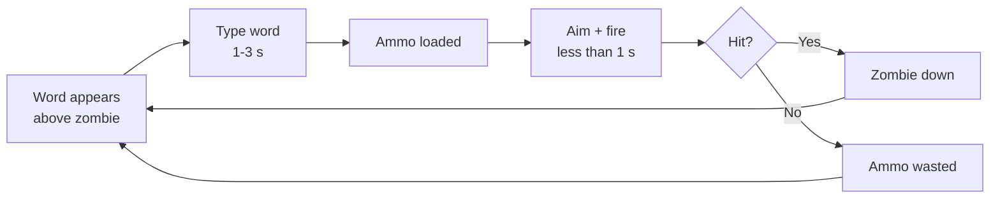

# Milestone 2 — Dead Keys

**Course:** CGRA 359, Trimester 2 2026
**Due:** Friday, 14 August 2026, 23:59

## Team

| Name | Role |
|---|---|
| Romart Danganan | Lead Programmer / Project Manager (architecture, git & issue-tracker setup, cross-team integration, documentation) |
| William Johnston | Gameplay & Mechanics Programmer |
| Josiah Natanielu | FX Programmer |
| Nicole Lai | Tools, Audio & Systems Programmer |

## Repositories

- Game repository (code, GDD, Tech Spec, all assets via Git LFS): https://gitlab.ecs.vuw.ac.nz/course-work/cgra359/2026/assignments/danganroma/dead-keys

No separate asset or tooling repositories exist; everything lives in the one repo above.

## Engine

Godot 4.7 (GDScript), Compatibility renderer, targeting Windows and Linux desktop primarily and macOS secondarily. Chosen because the game is entirely 2D and UI-driven: Godot's 2D pipeline and Control-node UI system map directly onto what the game needs (floating word labels, a typing input box, HUD panels) without the overhead of a 3D-first engine, GDScript's fast iteration loop suits a small team working across a single trimester, and the Compatibility renderer matches our stated minimum-spec target of integrated graphics with no 3D lighting.

## The Game

Dead Keys is a 2D top-down zombie-defense game for PC. The player defends a fixed base across a series of missions with no player-character or avatar on screen, only an aim reticle and HUD. Every zombie carries a word above its head; typing it loads a bullet, but typing never damages anything directly; the player must then aim with the mouse and fire manually, with no lock-on. Typing skill decides how much ammunition exists, aiming skill decides whether it's spent well.

### Core loop (what the MVP demonstrates)

Word appears above a zombie → type it (1–3 s) → a bullet is added to the magazine → aim with the mouse and fire (consumes one bullet) → hit kills the zombie, miss wastes the bullet → repeat against the next zombie. A mistaken keystroke costs a bullet immediately, and three consecutive mistakes jam the weapon for a short window. This is the loop the player repeats inside Mission 1, reached via a real Main Menu → Home Base → level-select flow rather than a bare gameplay scene, see Scope below for exactly what that surrounding flow does and doesn't do yet.

## Scope

**In scope for the game overall** (full detail in the GDD, `GDD.md`): the typing/ammo/aim/fire loop, a mistake system with an accessibility toggle, a unified Combo counter that also charges one equipped Ability per mission, a Mission Supplies system, permanent Weapon/Base upgrade tracks, 8 enemy types, and 6 missions with 2 bosses.

**Explicitly out of scope** (per GDD §1.6 non-goals, unchanged for this milestone): open-world movement, randomised loot, online multiplayer, controller support, procedural levels, multiple purchasable weapons (single upgradeable weapon only), and any rendered player character.

**In scope for this MVP specifically**, the full flow a marker can actually click through, not just the isolated combat loop:

- **Main Menu**: functional Start button into the Home Base. The Settings button is a real, visible placeholder, disabled, and hovering it shows "Will be implemented in Milestone 3" rather than doing nothing unexplained.
- **Home Base**: gold display, and the Upgrades / Mission Supplies / Ability Loadout panels are all visible with the same disabled-button-plus-hover-message treatment as Settings. Six mission cards are shown; five are locked, Mission 1 is unlocked and launchable, matching the GDD's sequential-unlock design (§3) even though missions 2–6 don't exist yet behind their locked cards.
- **Gameplay**: launching Mission 1 loads the actual playable prototype described above, one enemy type (Walker) spawning in waves with several instances alive at once, sharing one TypingController, in one hardcoded arena. The AmmoSystem is merged and HUD-integrated (#9), the TypingController supports multiple simultaneous Walker words with shared-prefix highlighting and word replacement on completion (#22, merged), and the wave-spawning Walkers are integrated into the shared gameplay prototype scene (#19).
- **Win/lose**: losing (wall health reaches 0) and winning (all zombies in the wave are cleared) both return directly to the Home Base scene. There is no Mission End / rating screen yet, that part of the GDD's screen flow (§3) is deferred to Milestone 3, so a win and a loss currently look the same from the outside beyond which one happened.

**Explicitly not attempted yet**: everything behind the disabled Home Base panels (real upgrades, real supplies, real ability loadout, real settings), a Mission End/rating screen, Missions 2–6, additional enemy types, and mission rating/medals, all deferred to the Milestone 2→3 gap per the GDD's own Must/Should prioritisation.

## Relation to Milestone 1

The game is built from Romart Danganan's Milestone 1 GDD (Option 1), submitted 24 July 2026. The rest of the team joined after the design presentation, as the GDD's own team table anticipated ("open to recruits from the design presentation"). No other Milestone 1 work (design or technology) from another student was brought into this project.

## The Plan

### Internal schedule (1 Aug → 23 Oct)

Two-week sprints from Milestone 2 onward, chosen for a four-person team where daily stand-ups aren't practical but momentum still needs checking regularly. The first two sprints below are shorter and cover the MVP build itself, retroactively documented here since the work is what this milestone is actually assessed on.

| Sprint | Dates | Goal |
|---|---|---|
| 1 | 1–7 Aug | Backbone: project and repo structure, the AmmoSystem, Main Menu/Home Base placeholder, gameplay scene and HUD shell, Git LFS setup. Mostly Romart, since this had to exist before anyone else's work had something to build against. |
| 2 | 7–14 Aug | Complete the prototype: weapon/projectile system, TypingController↔AmmoSystem integration, multi-Walker TypingController rework, Walker wave integration, mistake/jam fix, the Milestone 2 internal playtest. Target was a functionally complete prototype by ~11 Aug, achieved, leaving the remaining days for playtesting write-up, documentation, and the submission video rather than new features. |
| 3 | 14–28 Aug | Ability system + Combo counter, real Home Base shop UI, save/progression manager |
| 4 | 28 Aug–11 Sep | Mission Supplies system, remaining 3 of the first 4 enemy types, Missions 1–2 playable. **Playtest #2 at the end of this sprint.** |
| 5 | 11–25 Sep | Mission 3 + first boss, remaining upgrade tracks wired in. Vertical-slice checkpoint. |
| 6 | 25 Sep–14 Oct | Remaining 4 enemy types, Missions 4–6, second boss. **Feature freeze at the end of this sprint (14 Oct)**, no new features land after this date. |
| 7 | 14–23 Oct | Polish: bug fixing, the mission rating/medal system, audio pass, **playtest #3 (~16 Oct)**, final build and submission. |

Feature freeze sits 9 days before the Milestone 3 deadline rather than 2 weeks: with 4 people now instead of 1, bug fixing and building the mission rating system are both scoped as achievable in that window without needing the longer runway a solo build would.

Milestone 4 (30 Oct) is an individual reflection only, not a further game milestone, so no development sprint is scheduled between 23 and 30 Oct.

*This supersedes the week-numbered milestone labels in the GDD's MoSCoW table (§1.6), which were written before the real ~10-week gap between Milestone 2 and Milestone 3 was known. The GDD's Milestone column should be updated to reference this schedule instead of "wk 6-8" / "wk 9-10", noted as an outstanding GDD fix, not done in this submission to avoid scope-creeping this document.*

### Ownership

- **Romart Danganan** — core architecture (the AmmoSystem is done and documented as the integration contract other systems build against), the Ability System and Permanent Upgrades once built, cross-branch integration, issue/label/milestone setup, git workflow documentation.
- **William Johnston** — Gameplay & Mechanics: built the Walker enemy and wave-spawning (#11), and integrated those waves into the shared gameplay prototype scene (#19) on top of the multi-Walker TypingController fix below, now working end to end from Mission 1 launch through to win/lose.
- **Nicole Lai** — Tools, Audio & Systems: the TypingController, save/progression tooling, audio integration.
- **Josiah Natanielu** — FX: hit/death feedback, ability and supply-drop visual effects, once those systems exist to attach FX to. Not yet assigned a Milestone 2 issue; this is being corrected this week, in the meantime Josiah is picking up small FX polish on the existing zombie-death feedback so there's a real, reviewable Milestone 2 contribution rather than a gap.

We'll know someone is stuck if their assigned issue hasn't moved on the board for more than 3–4 days without a Discord update, at which point Romart follows up directly rather than waiting for a stand-up that doesn't exist yet. The board alone can be misleading if someone's mid-task and just hasn't updated the card, so this is cross-checked against whether their branch has had any new commits pushed in that window; no card movement and no commits together is the actual signal, not either alone.

### Version control, branching, ticket tracking

GitLab (linked above), with Git LFS configured for binary assets (issue #17, in review). Branch naming is `yourname/feature-description` (e.g. `romart/main-menu`). As of the 7–14 Aug sprint, the team runs a `dev` integration branch, suggested by William: feature branches merge into `dev` first, and `dev` merges into `main` only once it's stable, giving `main` an extra layer of protection against a broken merge landing directly on the branch a marker would check out. Direct pushes to both `main` and `dev` are disabled; every merge, at either stage, is a Merge Request requiring at least one approval from someone other than the author. Commit messages reference the issue number, e.g. `Add prototype combat HUD panels (#7)`, and an MR description with `Closes #N` auto-closes the issue on merge. All work is tracked as GitLab Issues under named milestones ("Milestone 1 - Pitch & GDD", "Milestone 2 - Prototype"); nothing is tracked outside the issue tracker.

### Definition of done

A feature is done when: it's merged through the branch → `dev` → `main` flow, with an MR approved by someone other than its author at each stage; it builds and runs in Godot with no new errors; it matches the relevant GDD section, or the GDD has been updated in the same MR if the implementation legitimately diverged from it; and the linked GitLab issue is closed. Writing a detailed MR description and a manual test note under `tests/manual/` is required practice for Romart's own merges, given the integration/testing-lead role, and strongly encouraged for the rest of the team, but it isn't a hard merge requirement for everyone, that's an honest gap rather than an enforced standard right now.

### Risks

1. **Onboarding / bus factor.** Most of the foundational architecture (project structure, the AmmoSystem) was built solo by Romart before the rest of the team joined, so there's a real risk teammates hit friction integrating with decisions they didn't make. Mitigated by documenting the AmmoSystem's public functions as an explicit interface contract before anyone else's work depended on it, by the mandatory MR-review rule surfacing integration confusion early rather than at the end, and by Romart writing long, itemised MR descriptions for every merge (what changed, what was tested, what's left as follow-up) rather than one-line summaries, so the reasoning behind a change is readable later without having to ask. The rest of the team is encouraged to do the same but isn't required to match that level of detail.
2. **Scope versus the 10-week gap.** The GDD's full vision, 8 enemy types, 8 abilities, 6 missions, 2 bosses, a full upgrade economy, is a lot for a 4-person team even across 10 weeks. Mitigated by the MoSCoW priority order already in the GDD (Must/Should before Could), the feature freeze on 14 Oct above, and a pre-agreed cut order if we fall behind: the second boss and half the ability roster go first, the core typing/mistake/combo loop never gets cut.
3. **Parallel integration.** Right now, the TypingController (#8), aiming/projectiles (#10), the Walker enemy (#11), damage/death/word-replacement (#12), and the mistake system (#13) are being built roughly in parallel by three different people, before any of them are wired together. Mitigated by issue #14 existing specifically as an integration checkpoint before the Milestone 2 deadline, and by the AmmoSystem's interface being written and documented before the dependent systems started. This risk already materialised once in a small way and the process caught it cleanly: the original TypingController tracked one Walker at a time, so it broke as soon as William's wave-spawning put several Walkers on screen at once. Because it surfaced on a branch (#22) rather than on `main`, Romart reworked the controller to a single shared instance with prefix matching across all active words, got it reviewed and merged, and William continued his integration (#19) on top of the fix without losing work. That's the process working as designed, not just a plan on paper.

### Negotiated variations

Automated CI/CD is deferred past Milestone 2. GDD §10 previously stated GitLab CI would validate every push; this has been changed to defer CI, with GUT unit tests introduced from Milestone 3 onward instead. Reasoning: with the team only just assembled, the available programming time is better spent finishing and integrating the core loop itself than building pipeline infrastructure around a prototype that's still changing shape daily; manual testing is being logged under `tests/manual/` in the meantime as a lighter-weight substitute.
